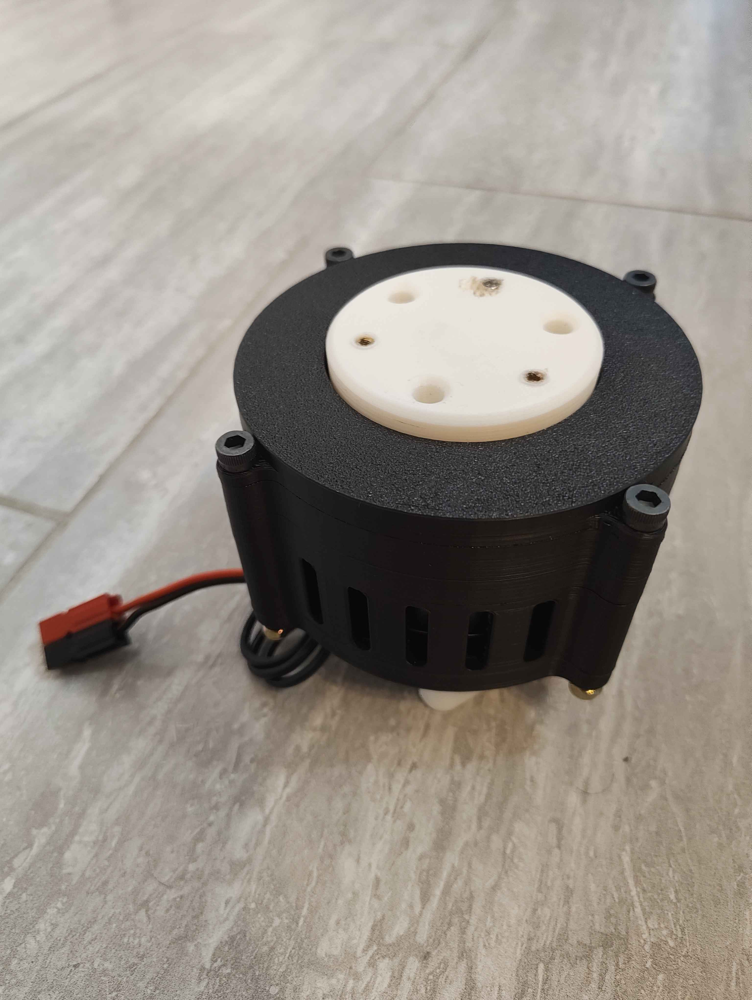

---
title: "Quasi-Direct Drive Actuator"
author: "Rahdeen Sigari"
description: "A small and cheap quasi-direct driven planetary robotic actuator."
created_at: "2026-05-09"
---

# May 9: Start

Essentially, my goal is to create a full 6-axis robotic arm, but in order to actually do that, I first need to design and build a powerful enough actuator. I've actually already built a similar actuator! Here's a photo:



The problem with this actuator however is that it is too large, heavy, and expensive to use for an actual 6-axis arm. That's why I'm making this, a smaller, lighter, and cheaper robotic actuator that can still be powerful enough to effectively drive a robotic arm. Specifically, I want this actuator to be at most 3" in diameter.

In mechatronics applications like this, it is important for actuators to be somthing called *Quasi-Direct Drive.* Quasi-Direct Drive (QDD) actuators have a high enough gear ratio so that they can actually move signficant loads while not being so powerful that they cannot be backdriven. This is important as QDD actuators like this can completely eliminate the need for external touch sensors, as the actuator cannot overpower the external forces that are put upon it. This allows for the firmware to detect the resulting current increase and register that it has came in contact with an object.

I was kind of inspired to do this by Aaed Musa's [video](https://www.youtube.com/watch?v=GFLa1b1juUo) of him making another robot dog. He actually used something called a capstan drive, which is a gear reduction achieved by using ropes. Instead, I'm using a planetary gearbox, as it's the cheapest option and the best for small reductions like the ones in a QDD actuator as opposed to something like a cylcoidal drive. What really intrested me though was the hardware he used, specifically the motors and motor controllers. He used the following:

- Makerbase XDrive Mini (motor controller)
- TYI 5008 Brushless Motor

For my old actuator, I used:

- ODrive S1 (motor controller)
- Eaglepower LA8308 KV90 (motor)

Don't get me wrong, the hardware I bought worked excellently, but it would absurd to use them for something like a robotic arm, they're just too expensive. Luckily, the amount of power that I got from my old actuator is way more than I need for my eventual goal of making a robotic arm, as long as I keep everything else lightweight. In comparison, without accounting for extra fees, all the hardware that Aaed Musa used is $177.71 cheaper than what I used, which is absolutely absurd. For the record, if I had tried making a 6-axis arm with my old hardware, it would cost $1066.26 more!

I'm happy with the XDrive Mini as my new motor controller, but not entirely confident in the motor's strength, as it has a very high KV, which is not ideal for QDD actuators. The easiest way to fix this without increasing the gear reduction (which would result in it not being QDD anymore) is to recoil the motor stator, which I would like to avoid if I can. Will do some more research later on any alternative motors I can use.

**Total time spent: 1 hour**

# May 10: Researching Motors

I already established the TYI 5008 as good option, but its problem is mainly that it would need me to recoil the stator to decrease its KV (and subsequently increase its torque) to around 100. Ideally, I'm looking for a motor around 50mm in diameter.

- After a bit of research, I found [this](https://www.rctimer.com/rctimer-gbm5010-150t-gimbal-brushless-motor-p0446.html) motor. It is already 90KV, which means that I won't have to recoil it, but the main problem is that it is most likely too small.
- [Here's](https://rctimer.com/rctimer-5010-260kv-multirotor-brushless-motor40mm-shaft-p0132.html) another one, this one still needs to be recoiled, but the KV is much lower so it will be easier. Kind of slow shipping time though.
- [Another one](https://www.aliexpress.us/item/3256808560627221.html). This one is probably the most promising, its cheap, decent shipping time, and similar specs to the TYI 5008, of course, it will, of course, still need recoiling.

Sadly, thats all I could really find. To be honest, all these motors are pretty similar, but I think I'm going to with the third option, which is a 5010 360KV motor off Aliexpress. If I'm being honest, this is mostly because it ships the fastest out of any of the alternatives, all these motors are either 5010 or 5008 motors, and pretty much all of them except for the first one I found need to be recoiled (translation: I chose the third one based off vibes). I might buy one so that I can test its capabilites.


**Total time spent: 1 hour**

# May 11: Starting CAD (Or not)

Think I'm ready to start actually planning this out in CAD. I found [this](https://grabcad.com/library/bldc-motor-5010-1) CAD model of the motor, its supbar, but it will do for now:


Ok I did a bit more research, and I want to slightly pivot my plans. Instead of jumping straight into modeling this in CAD, I want to buy a motor first and see how well it performs, and also see its actual shape in real life as opposed to the, for lack of a better term, shitty CAD model that I found. This will let me actually CAD effectively instead of guessing. I can still work on the actual gearbox and the output stage while I wait. I've got finals to study for though so I'll save that for another time.

**Total time spent: 35 minutes**

# May 17: CAD Work

I found [this](https://grabcad.com/library/mks-odrive-mini-1) model of the motor controller, the step file that they provided did not work, so I had to import the .dwg file they gave into Fusion 360, then export that as a .step for it to work inside of OnShape:


The problem now is how I'm going to mount everything. Mounting the motor controller is pretty straight forward, really all I need are some heat-set inserts in the base motor casing that I can use to bolt it directly on. The problem is the motor itself. The CAD is very unclear about this (so is the listing on aliexpress itself) but I'm assuming that the shaft in the center of the bolt circle rotates independently from the bolt holes:


Most motors like this have some sort of bearing around the shaft, but it isn't visible in the CAD, and for some reason all the distributors of the motor seem to be allergic to giving any views other than the front of the motor, so I'm hoping this is actually how it's going to function. The best way to mount this is probably to have some countersunk holes on the bottom of the motor carriage, on the same face as the motor controller's heat-set inserts, where I can fasten the motor with some countersunk bolts. Now, for the motor controller to actually find the position that the motor is in, there needs to be a diametric magnet on the motor shaft that the motor encoder located on the back of the controller can read the position of. A diametric magnet is essentially just a magnet magnetized along its diameter as opposed to its vertical midplane. This allows the encoder to read the position of the poles, which translates to the position of the motor. [McMaster-Carr](https://www.mcmaster.com/products/magnets/direction-of-magnetization~through-diameter/) has a pretty large catalogue of diametric magnets. An 1/8" magnet will fit pretty well on the shaft of the motor. [This](https://www.mcmaster.com/5862K411/) magnet meets my specifications pretty well. It's almost the perfect size to fit directly on the shaft. I designed this small 3D printed part to mount the magnet:


I'm going to quickly print it to ensure it can be printed, it's a really small part so I'm concerned if it can be printed or not.


It printed, its so small though that I'm not sure if the parts will actually fit? If not, I will just directly glue the magnet on with a template.

I started making a layout sketch of the entire actuator, what I realized was that in order to keep a 2mm distance from the onboard motor controller and the magnet, there would only be around 1mm of clearance for a countersunk hole... which is not enough. To fix this, I'm using [this](https://www.mcmaster.com/5862K202/) magnet instead, which is a 1/16" taller. I have around 2.5mm of room now, which is definitely enough. Here is the sketch so far:


Alright it's time to talk about the gear reduction I'm using. In the past, I've used 8:1 with success, and I think I'm going to stick with 8:1 for this as well. I would like to use 4 planet gears, but it's not quite possible to get them to fit...


Which is why I'm just sticking with 3. With some playing around, I found that the perfect size for the gears are:

- Sun: 8 teeth
- Planet: 24 teeth
- Ring: 56 teeth

Using all of that, I made a (VERY!!!!) rough layout sketch of the actuator:


I very much expect to change all of this later but for now it's good enough for me to start cadding the actual parts :)

**Total time spent: 2.33 hours**

# May 18: More CAD Work - Physical Parts

I started by starting to make the motor carriage, but I think there's a very big (literally) problem:


As you can see, if I want my motor controller to fit nicely in the actuator profile, I would need to make it much larger in diameter. This would cause it go out of my 3" diameter design constraint. So, the only option would be to find a motor controller with a smaller profile. My first thought was the ODrive Mini. It's more expensive, but it has the same features as the XDrive while being much smaller plus having the added benefit of having a GUI. Another option would be to use a cheaper controller like the moteus-c1 that doesn't have UCB-C compatibility, then making my own CAN to USB-C adapter. The price difference is negligible enough that it's not worth doing that though, so I'm just going to pivot to the ODrive Micro for now. Unfortunately this means I'm going to have to change a lot of stuff. Because of this change, I can actually go back to using a 1/16" tall magnet!

Redid the layout sketch:


Didn't really journal as I was working on it so I'm just to explain what happened. I started modeling the motor carriage. Since there are components under the pcb as well, I had to slightly offset it from the base of the motor carriage. At first, I tried adding a large flange at the bottom, but it still interfered with some of the components at the very edge of the board so I'm just going to use some 3dp spacers instead:


Like I mentioned before, the motor is mounted by some countersunk bolts right below the motor controller. The actual controller is mounted with [these](https://www.mcmaster.com/94459A769/) heat-set inserts. I also started thinking about the gears. I decided to bring the dp up to 22.5 instead of 20 as that allow the pitch diameter of the ring gear to sit slightly further in from the inside of the motor carriage:


The entire assembly so far:


**Total time spent: 2.4 hours**

# May 22: CAD Work + Motor Came

Look what came today!


And, as I guessed, the CAD was inaccurate after all. Turns out where I thought there was just a nub on the bottom on the motor was actually a screw:


Because of this I have to change the magnet mount. I started by updating the CAD to be accurate:


Then I redid the magnet mount:


Then, I made the entire casing smaller, there was a lot of unnecessary extra space between the motor and the casing before that I got rid of:


Because of this, I had to increase the dp of the gears again to 27.5. The gears need a carriage to ride on, and said carriage must be able to rotate freely. This can be done using a large bearing with the carriage riding inside. For my old gearbox, I used [these](https://wcproducts.com/products/WCP-1870) bearings, and they worked wonderfully, so I'm going to continue using those. From here I moved on to modelling the sun gear. However, I encountered a problem very quickly:


The gear itself was blocking the countsink holes. To fix this, I had to have the gear itself snap fit onto the mounting base. I had to spend a lot of time figuring out a shape that I could actually print. This is what I have right now, but I'm definitely going to have to change it:


**Total time spent: 1.75 hours**

# May 24: CAD Work - Sun Gear and Gear Carriage

Continued where I left off yesterday by continuing to iterate on ways to solve the sun gear mounting problem. At first, I tried making another of a snap fit design that could actually reasonably work:


After trying to print it though, it was evident that this was not the solution, as my printer cannot print in enough detail to be able to create small features like these. Because of this, I decided to pivot to a simpler solution, which was to simply raise the gear up vertically, giving some space to get bolts into:


Testing it out, I found that because of the low amount of material at the base, it was very easy for the gear to snap off the mounting base. However, I could actually fit the bolts in the holes now with this modification. To increase the strength at the base, I kept some of the original gear profile intact:


Even with this modification, the gear was still weaker than I'm happy with. For the actual production parts I am definitely going to have to use a more ductile material like PETG instead of PLA, but PLA is fine to prototype with for now. I briefly had a problem of the clearance hole for the motor shaft in the sun gear being too short, but this was a quick fix. Here's what the gear looks like on the motor, I couldn't bolt it in because I don't have the right length flathead bolts:


Noticed this, the motor carriage is interfering with the motor. Very easy fix:


(Forgot to mention this earlier, [this](https://cad.onshape.com/documents/f349bdd78c53f3325055aefc/v/0ca31cd0b35e796be912d9e2/e/53214cbff7d86d5817cf8efb?showReturnToWorkspaceLink=true) is the featurescript I used to generate the gear.

I then started working on the planet gear carrier. First, I made the basic shape. The flange on the bottom rests on top of the x-contact bearing, and the cutout and hole in the middle is to give the sun gear clearance:


**Total time spent: 1.32 hours**

# June 1: CAD Work

First I made the planet gear, just to get a visual of the geometry, I'm going to have to change some things about it.


So here's the problem, there are two solutions to get the gears to move smoothly with as little friction as possible. Either:

- Completely coat the carriage with a lubricant, reducing friction without the need for any external hardware.
- Have the planet gears rotate on bearings to smooth out movement.

Since this project is completely 3D printed, and I want to reduce the mess as much as possible, I'm going to go with the second option of using bearings. Now, here's the actual issue. Bearings are huge. This is what I did in my last gearbox:


The problem is that since I'm reducing the size of my gears, I don't have enough space to fit in a full sized ball bearing set into the gear. To fix this, I need to different type of bearing. I did a bit of research, and I stumbled upon [these](https://www.mcmaster.com/5905K496/) needle-roller bearings. They're technically not as smooth as ball bearings, but with some lubrication they should still work perfectly fine.

With these changes in mind, here is the planet gear I created. Unfortunately, this meant upping the heigt of the gears, and by result, the gearbox. Unfortunately just one of the results of using a stock motor for an actuator:


I then designed these extrusions on the the gear carrier for the planet gears to rotate on. The hole in the middle is for a heat-set insert.


Assembly:


I'm not modelling the motion right now because I really don't care enough to. Here's the ring gear:


Next, I mmade the output plate. There are three countersunk holes to secure it to the gear carriage, as well as three heat set inserts to mount other components to it:


Then, I made a top cover for the entire gearbox. I also added 5 M5 holes to put bolts through in order to secure the entire assembly:


I also added these "vents" so I could see the motor turning + because it looked cool:


Also, I added this wire cutout in the base of the motor carriage, without it there's nowhere for the wires to go:


With that, the CAD is actually complete! I was originally going to add a motor controller cover, but I see no need to as it would just limit my access to the port:


**Total time Spent: 3 hours**

# June 2 - Touchups and Docs

Before I start uploading all my documentation, I printed everything out just for a quick fit check.


Some problems I found:

- M3 clearance holes were too small. (For some reason I had it set to close fit?)
- The actual mounting on the motor weren't aligned with the wires. I'm not going to fix this yet because I'm going to be recoiling the motor anyways.


Everything else seems to be fine right now.

I added some stuff in my README, then created my BOM. A lot of cost comes from the fasteners, but I already have a lot of them.
| Quantity | Name                  | Vendor     | Cost    | Link                                                  | Notes  |
|----------|-----------------------|------------|---------|-------------------------------------------------------|--------|
| 1        | 5010 BLDC Motor       | AliExpress | $19.66  | https://www.aliexpress.us/item/3256808560627221.html  |        |
| 1        | 1.75"" X-Contact      | WCP        | $34.99  | https://wcproducts.com/products/WCP-1870              |        |
| 3        | Needle-Roller Bearing | MCM        | 23.58   | https://www.mcmaster.com/5905K496/                    |        |
| 7        | M3 Heatset x 3.4mm    | MCM        | 8.64    | https://www.mcmaster.com/94459A769/                   | 1 Pack |
| 3        | M3 Heatset x 5.9mm    | MCM        | 5.48    | https://www.mcmaster.com/94459A421/                   | 1 Pack |
| 1        | ODrive Micro          | ODrive     | 89      | https://shop.odriverobotics.com/products/odrive-micro |        |
| 4        | M3x0.5 8mm FH         | MCM        | 5.82    | https://www.mcmaster.com/91294A128/                   | 1 Pack |
| 4        | M3x0.5 5mm FH         | MCM        | 5.57    | https://www.mcmaster.com/91294A125/                   | 1 Pack |
| 3        | M3x0.5 10mm FH        | MCM        | 6.36    | https://www.mcmaster.com/91294A130/                   | 1 Pack |
| 4        | M3x0.5 10mm BH        | MCM        | 7.91    | https://www.mcmaster.com/92095A182/                   | 1 Pack |
| 5        | M4x0.7 50mm SH        | MCM        | 15.85   | https://www.mcmaster.com/91290A186/                   | 1 Pack |
| 5        | M4x0.7 Nuts           | MCM        | 13.25   | https://www.mcmaster.com/94645A101/                   |        |
|          |                       |            | $236.11 |                                                       |        |

**Total Time Spent: 1.25 hours**

# June 3 - Bearing Changes

Ok I got some opinions on using the X-Contact bearing, because it is ridiculously expensive, and I've decided that something that high quality is not needed at all. Instead, I found [this](https://www.aliexpress.us/item/3256807233759178.html) bearing on AliExpress. It's slightly different in size, so I had to change some parts to get it to fit properly, but this is definitely going to be the more cost effective option:


Here is the updated BOM:

| Quantity | Name                  | Vendor     | Cost    | Link                                                  | Notes  |
|----------|-----------------------|------------|---------|-------------------------------------------------------|--------|
| 1        | 5010 BLDC Motor       | AliExpress | $19.66  | https://www.aliexpress.us/item/3256808560627221.html  |        |
| 1        | Output Bearing        | AliExpress | $4.39   | https://www.aliexpress.us/item/3256807233759178.html  |        |
| 3        | Needle-Roller Bearing | MCM        | 23.58   | https://www.mcmaster.com/5905K496/                    |        |
| 7        | M3 Heatset x 3.4mm    | MCM        | 8.64    | https://www.mcmaster.com/94459A769/                   | 1 Pack |
| 3        | M3 Heatset x 5.9mm    | MCM        | 5.48    | https://www.mcmaster.com/94459A421/                   | 1 Pack |
| 1        | ODrive Micro          | ODrive     | 89      | https://shop.odriverobotics.com/products/odrive-micro |        |
| 4        | M3x0.5 8mm FH         | MCM        | 5.82    | https://www.mcmaster.com/91294A128/                   | 1 Pack |
| 4        | M3x0.5 5mm FH         | MCM        | 5.57    | https://www.mcmaster.com/91294A125/                   | 1 Pack |
| 3        | M3x0.5 10mm FH        | MCM        | 6.36    | https://www.mcmaster.com/91294A130/                   | 1 Pack |
| 4        | M3x0.5 10mm BH        | MCM        | 7.91    | https://www.mcmaster.com/92095A182/                   | 1 Pack |
| 5        | M4x0.7 50mm SH        | MCM        | 15.85   | https://www.mcmaster.com/91290A186/                   | 1 Pack |
| 5        | M4x0.7 Nuts           | MCM        | 13.25   | https://www.mcmaster.com/94645A101/                   |        |
|          |                       |            | $205.51 |                                                       |        |

**Total Time Spent: 0.58 hours**

# June 4 - Preparing for Recoiling the Motor

Alright first, I actually forgot to include the [diametric magnet](https://www.mcmaster.com/5862K413/) in the BOM, so I quickly updated it to reflect that.

Here's the updated BOM:

| Quantity | Name                     | Vendor     | Cost    | Link                                                  | Notes  |
|----------|--------------------------|------------|---------|-------------------------------------------------------|--------|
| 1        | 5010 BLDC Motor          | AliExpress | $19.66  | https://www.aliexpress.us/item/3256808560627221.html  |        |
| 1        | Output Bearing           | AliExpress | $4.39   | https://www.aliexpress.us/item/3256807233759178.html  |        |
| 3        | Needle-Roller Bearing    | MCM        | 23.58   | https://www.mcmaster.com/5905K496/                    |        |
| 7        | M3 Heatset x 3.4mm       | MCM        | 8.64    | https://www.mcmaster.com/94459A769/                   | 1 Pack |
| 3        | M3 Heatset x 5.9mm       | MCM        | 5.48    | https://www.mcmaster.com/94459A421/                   | 1 Pack |
| 1        | ODrive Micro             | ODrive     | 89      | https://shop.odriverobotics.com/products/odrive-micro |        |
| 4        | M3x0.5 8mm FH            | MCM        | 5.82    | https://www.mcmaster.com/91294A128/                   | 1 Pack |
| 4        | M3x0.5 5mm FH            | MCM        | 5.57    | https://www.mcmaster.com/91294A125/                   | 1 Pack |
| 3        | M3x0.5 10mm FH           | MCM        | 6.36    | https://www.mcmaster.com/91294A130/                   | 1 Pack |
| 4        | M3x0.5 10mm BH           | MCM        | 7.91    | https://www.mcmaster.com/92095A182/                   | 1 Pack |
| 5        | M4x0.7 50mm SH           | MCM        | 15.85   | https://www.mcmaster.com/91290A186/                   | 1 Pack |
| 5        | M4x0.7 Nuts              | MCM        | 13.25   | https://www.mcmaster.com/94645A101/                   |        |
| 1        | Diametric Encoder Magnet | MCM        | 1.48    | https://www.mcmaster.com/5862K413/                    |        |
|          |                          |            | $206.99 |                                                       |        |

Anyways, while I wait for this to be reviewed on Forge, I'm going to start doing the calculations on how I'm going to recoil the motor. To review, the motor that I have right now is wired in delta-configuration, which means that the three stator windings are connected in a closed loop that resembles a triangle. Each winding's end is connected to the other winding's beginning, making a continuous circuit. There are a couple advantages of a motor wired in delta-configuration. The main advantage of this type of winding is that it can achieve higher torque at higher speeds as opposed to star-configuration coiled motors. Although this sounds like a good thing, these motors are much less efficient at low speeds, as it draws more current for the same amount of torque. Heat generation is also increased with delta-configuration. They are ideal for high-speed applications, but for a robotic actuator, star-configuration is definitely the way to go.


Star configuration is different as all three stator windings are connected to a central point called the neutral point. This forms a star, or Y shape. The other ends of the windings are then connected to the motor controller. This configuration is better suited to give high effeciency at low speeds, which is why it is ideal for this application. A general rule between delta and star-configuration is that delta-configuration coiled motors have a $\sqrt{3}x$ higher KV then star-configuration coiled motors.


Here's the problem: If I were to recoil the motor with the exact same turns/slot and wire awg as the manufacturer, I would get ~208 KV, which is way higher than what I'm aiming for. Luckily, the KV rating is proportional to the number of turns/slot on the motor. So I can divide $208/100$ (100 being the KV I'm aiming for) to get $2.08$. This means that I have to use $2.08x$ the turns/slot to get to 100KV. Since the windings are layered on top of eacher other on my motor, counting the turns/slot is going to have to require taking apart the winidngs, so first, just to make my calculations more accurate, I'm going to find the actual KV of the motor to see if it's accurate or not. To do this I'm going to use the following formula:

$KV=RPM/(V*\sqrt{3})$

I'm multiplying the voltage by $\sqrt{3}$ because the motor is currently coiled in delta configuration. Normally you would use something like a lathe or a drill for this, but I don't have access to anything like that so I'm just going to use the motor from my old actuator. I had this old test mount laying around that I'll use:


Then I wrote this quick script to set the motor to a desired RPM:

```python
import odrive
import time

from odrive.enums import *

odrv = odrive.find_any()
axis = odrv.axis0

axis.controller.config.control_mode = ControlMode.VELOCITY_CONTROL
axis.controller.config.input_mode = InputMode.PASSTHROUGH
axis.requested_state = AxisState.CLOSED_LOOP_CONTROL

axis.controller.config.vel_limit = 30.0

time.sleep(0.5)

def set_rpm(axis, rpm):
    turns_per_sec = rpm / 60.0
    axis.controller.input_vel = turns_per_sec

def get_actual_rpm(axis):
    turns_per_sec = axis.pos_vel_mapper.vel
    return turns_per_sec * 60.0

set_rpm(axis, 500)

try:
    while True:
        print(f"Target: {axis.controller.input_vel * 60:.1f} RPM | "
            f"Actual: {get_actual_rpm(axis):.1f} RPM")
        time.sleep(0.1)

finally:
    print("Stopping motor...")
    axis.controller.input_vel = 0.0
    time.sleep(0.5)
    axis.requested_state = AxisState.IDLE
    print("Motor Stopped")
```

Alright I'm going to be honest I restarted my computer and lost an hour of progress on the journal... So if the following stuff I write isn't as detailed that's why.

I'll quickly go over how the script works:

```python
import odrive
import time

from odrive.enums import *

odrv = odrive.find_any()
axis = odrv.axis0

axis.controller.config.control_mode = ControlMode.VELOCITY_CONTROL
axis.controller.config.input_mode = InputMode.PASSTHROUGH
axis.requested_state = AxisState.CLOSED_LOOP_CONTROL

axis.controller.config.vel_limit = 30.0
```

This block is the setup. I'm importing the ODrive pip module and time, then importing all the enums from the module. Then, I'm searching to see if any ODrive boards and connected and assigning the motor to axis0. In the last 3 lines, I'm setting the control mode to velocity, the input mode to passthrough, which allows me to control it directly, and setting the axis state to closed loop control. I also set the velocity limit to 30 because by default it was capping me to 600 rpm. I'm pretty sure after you run this once, you don't need that line anymore but I kept it just incase.

```python
time.sleep(0.5)

def set_rpm(axis, rpm):
    turns_per_sec = rpm / 60.0
    axis.controller.input_vel = turns_per_sec

def get_actual_rpm(axis):
    turns_per_sec = axis.pos_vel_mapper.vel
    return turns_per_sec * 60.0

set_rpm(axis, 500)
```

The time.sleep is to give me a second before the motor start spinning. I defined two functions next, one to set the rpm that the motor will be rotating at. I have to divide by 60 because ODrive doesn't handle velocity in RPM. I'm then setting the input velocity to that new value. The get_actual_rpm function gets the encoder reading of the motor. This is to detect if there are any great disparities between the value I set and the actual RPM. I then set the RPM of the motor using the set_rpm function.

```python
try:
    while True:
        print(f"Target: {axis.controller.input_vel * 60:.1f} RPM | "
            f"Actual: {get_actual_rpm(axis):.1f} RPM")
        time.sleep(0.1)

finally:
    print("Stopping motor...")
    axis.controller.input_vel = 0.0
    time.sleep(0.5)
    axis.requested_state = AxisState.IDLE
    print("Motor Stopped")
```

This final block constantly prints the RPM I set the motor to run at and the actual RPM that the encoder detects. It's in a try-finally block because the ODrive module doesn't have a way to deal with the script being terminated by default. Honestly I didn't really need to write a script for this, I could've just used the GUI, but I needed to learn how to code for ODrive anyways so I don't mind.

I quickly modelled an adapter and test stand in CAD that allows me to connect the LA8308 (the golden motor) to the 5010 so I can test the KV. The prongs on the adapters catch each other and rotate:


This is full setup with everything printed:


I was kind of confused at first when I initally ran the motor because I had the multimeter on detecting DC current, so it was just reading 0, but after some reaearch I realized what I did wrong so I switched the multimeter to AC and tried getting readings. I tried running the motor at different RPM's to see if the results varied. Here are the results. I tried every combination of phase wires to get the most accurate result.

1000 RPM
- 1: 1.7V
- 2: 1.7V
- 3: 1.7V

500 RPM
- 1: 0.7V
- 2: 0.7V
- 3: 0.7V

1500 RPM
- 1: 2.7V
- 2: 2.7V
- 3: 2.7V

Here is the KV rating I calculated for each speed:
- 1000 RPM: 340 KV
- 500 RPM: 413 KV
- 1500 RPM: 320 KV

There's a huge difference between the values, especially at 500 RPM. This might be because it's just too slow, so I'm going to delete that data point and try again at 2000 RPM. I got 3.1V all around using 2000 RPM, which translates to 372 KV. Still a bigger difference then I would have liked, but it's not as bad anymore. Taking the average of all three values gives me 344, so not exactly 360 as the manufacturer listed. I'll be using this value for my future calculations. Now that I have the actual KV of the motor, I can go ahead with starting to take it apart.

**Total Time Spent: 3.65 hours**

# June 5 - Recoiling Calculations + Uncoiling Motor

Alright, so I completely uncoiled the motor:


As I was uncoiling it, I counted the amount of turns-per-slot and got 23. Since the KV of the motor is proportional to the turns-per-slot, I can now calculate how many I need to get 100KV:

First I need to account for the motor being in delta configuration:

$344/\sqrt{3}=199$

Then, If I divide that by the KV I want, I get the ratio of how many times more windings I need to get to my desired KV rating:

$199/100=1.99$

$1.99*23=45.8$

45.8 then rounds up to **46**, the turns-per-slot necessary.

**Total Time Spent: 0.35 hour**

# June 6 - Recoiling Attempt #1 + CAD Fixes

I got some cheap 24 AWG magnet wire today, and I tried to recoil the motor using the following diagram:


However, I believe that 24 AWG is too large of a diameter, so I am going to return the spool I got and try 26 AWG instead.

Also, I got some feedback on my design and have a couple changes to make. First, with the current design I can straight up just pull the output disc and the entire gear system will disengage from the main bearing. To fix this, I'm going to add a flange underneath the bearing as well secured by a plastic threading screw.


Here's it implemented:


I decided to not use plastic tapping screws and just use regular screws and heat set inserts as it would be cheaper.

**Total Time Spent: 1.28 hours**

# June 8 - Rewinding Attempt 2

May god help me because this is the most painful process of all time. Obviously I couldn't record journal entries as I was winding the motor, but I basically tried the same thing as before except with 26 AWG wire instead. The good news is that I can actually fit 46 windings in one slot, the bad news is that it was extremely messy and extremely difficult to wind, especially if I was winding a slot that already had another fully winded one right next to it. I technically got an entire phase wired, but I am very unhappy with the result, and I am most likely going to unwind it again. Another possible idea I have is to take out the center bearing stack by heating the adhesive holding it and the stator together. This will making rewinding the stator much easier. Here a couple photos I took of the rewinding process:


**Total Time Spent: 1.73 hours**

# June 9 - Exploded View

The project got returned because I didn't have any assembly instructions, so I'm just going to really quickly make an exploded view showing how everything fits together. Here it is, as well as a section view:


I'm also going to add them to the README and add a quick paragraph laying out some important points. I also updated the CAD folder with the new step files.

**Total Time Spent: 0.55 hours**

# June 19 - Added full STEP file + Updated BOM

Project got returned because I didn't have a full STEP file of the assembly included. I added it as Main.step in the cad folder. Also, because of some earlier changes I made, the retention bolts were too short so I had to up their length to 55mm. I then updated the BOM to reflect that change.


**Total Time Spent: 0.1 hours**

# July 4 - Recoiling Work

Alright, I'm back to work on this after forever! So, here's what I'm going to do. Right now, 46 turns is essentially impossible to get on the motor stator, so, unfortunately, I am going to have to settle for less turns. Instead of trying to go for 100KV, I'm instead going to settle with 150KV. Doing the calcuations again, I need around 31 turns per slot to achieve this. With that in mind, I tried recoiling one phase of the stator. It was still slightly difficult and I had to redo some individual slots a couple times but I eventually got this:


As you can see, I slightly messed up which stator slot I had to route on the last two, but it proved regardless that 31 turns were much easier to route than 46. Luckily, I was going to recoil at least the last slot anyways so it wasn't too big of a deal. I'm going to fix the mistake and continue recoiling tommorow hopefully.

**Total Time Spent: 1 hour**

# July 21 - Clarification for Reviewers

Hello, someone dm'd me on slack about this so I just want to clear it up here. Look at the PDF BOM in the docs folder please, not the CSV or the one in the readme. The parts highlighted (so just the motor for now, and potentially the ODrive if that's not applicable for funding) do **NOT** need funding, I already have the motor, as I needed to buy it beforehand to actually get the dimensions for the CAD model.

**Total Time Spent: 0 hours**

# July 23 - Starting to Build

I got my grant yesterday and ordered all of my parts. McMaster-Carr has extremely fast shipping so all of the parts from them already arrived!


If you remember, I already have all the parts printed, so I just immediately started the build. First, I put the needle bearing in the gears. The clearance was nice, so they fit in perfectly:


Next, I'm going to use my soldering iron to put all the heat-set inserts in. I encountered a pretty big problem while doing this, my heat-set insert tip on my soldering iron is very dirty, so dirty that melted plastic that it caught would get stuck in the threads of the heat-set inserts, basically making them useless. Luckily, I have an M3 tap so I literally just retapped the heat-sets, it's kinda rough but it should do. I am also going to reprint and re heat-set the output disk in white.


One more thing, there's a lot of play between the needle bearings and the internal shaft on the carriage, so I think I'm going to reprint that as well. I'm honestly just going to make that white PLA as well, I doubt that needs to be PETG-CF. As you can see, I originally subracted 0.005" so that it would fit, but this was clearly unnecessary.


I'll write a new journal entry once everything gets printed.

**Total Time Spent: 1.1 Hours**

# July 24 - Change to Gears + Assembly

Alright, so this change was from yesterday but I didn't record it, but I added a little base to the planet gears to help retain the bearings in place, as the bearings were actually slightly shorter than the gears.


With this change and all the ones from yesterday, I printed all of the parts, the gears out of PETG-CF, and the carriage and output disk out of white PLA. Then, I added heat-set inserts to all the parts that needed them and put the needle bearings into the new planet gears. Taking out the needle bearings out of the old gears was quite difficult, as they were retained very well in place, but I eventually had the idea to heat up my 3D printers bed to loosen the filament and push them out.


I also assembled the carriage with the parts that I had available. Everything rotated decently smoothly, but it will be even better with some white lithium which I will put on during the final assembly.


And for good measure, I assembled the entire shell together.


I also updated the github repo with these parts. All that's left to do now is finish rewinding the motor and wait for the other parts to arrive.

**Total Time Spent: 1.22 Hours**

# August 7 - Bearings arrived, carriage changes, recoiling

I forgot to journal most of this stuff earlier so a quick overview of what happened:

First, my bearings came!


Here's the problem: Currently in the CAD I have a slight clearance fit between the gear carriage and the bearing itself. This was done to account for 3D print inaccuracy and tolerances, however I am willing to bet that the bearing was manufactured with unilateral negative tolerances. To fix this, I am going to change the fit of the carriage to be a slight interference fit instead of clearance. I went ahead and printed it out as well. While I'm waiting for it to finish printing, I'm going to try to recoil the stator again. I've been putting this off for a while because of how annoying of a process it is, but I think I just have to bite the bullet and get it done with. Last time I tried to recoil the stator, I accidently coiled the wrong stator slots on one side, so first, I need to redo those two slots:


From there on it went pretty smoothly. Here's the second phase:


And finally the third:


Once all the phases were coiled, I soldered all their ends together at one central star point (since this is now in star configuration):


Then I soldered all my wires on and wrapped them in heatshrink:


After this, I connected the motor to my old ODrive S1 like I did earlier. For some reason, I am getting the error "PHASE_RESISTANCE_OUT_OF_RANGE" when I try to calibrate the motor. I'm really tired right now so I'll pick up trying to fix this tomorrow.

**Total Time Spent: 2.9 Hours**

# September 20 - CAD Changes

It's been a while since I've worked on this, but it seems like for some reason a lot of my journal entries are gone? A lot of stuff happened after the last journal entry, so I'm just going to quickly go over everything. The error from the last entry was fixed through some changes in the ODrive settings, and with those settings changed, everything worked fine (I believe I changed the phase resistance value in ODrive configuration to a value that I measured, but again this happened a while ago so I don't quite remember). After I got the motor to work, I tried to assemble everything, here are a couple photos:


When I tried backdriving the actuator after assembling it, the sun gear actually snapped from the base and there was way more friction then I anticipated:


I believe this happened because I didn't account for the axial thrust force that helical gears generate. I'm going to fix this today by switching to either spur or herringbone gears. I also got my design review by a couple of people and I have a general idea of some other changes that I want to make.

The first thing I did was to make all of the gears spur gears. I started with the sun gear, and this was pretty straightforward. Having it be a spur gear also made making the cutouts for the screws much easier:


The bad thing was that this broke a LOT of my features, but most of these were just changing the reference:


The other gears were also really straightforward, nothing really noteworthy except for having to change more references:


I also had to update the assemblies to match:


The next issue was that there was no clearance between the planet gears and the output disk:


I was initially going to print separate washers entirely to space them apart, but instead I decided on a different approach and just added spacers fused to the bottom of the output disk:


I also went ahead and beefed up the base of the sun gear with some extra material:


Honestly, that's all the changes that I can realistically make while still staying in scope. There's a lot of stuff that I want to change but can't quite do right now, but I will certainly keep in mind when designing another actuator like this in the future (credit to BitSentinel and Eliot):

- An output bearing at the top of the actuator as well as one for the carriage.
- Using a bigger motor controller like I planned on doing before.
- Heatsinking for the motor controllers and the motor.
- Needle bearings must be rolling on a hardened steel shaft, not a 3D print or even an aluminum part.

For now though, I think these changes will be sufficient. I'm going to go ahead and print out all of the changed parts.

First, the output disk. I'm printing this first because I already have white filament loaded on my printer. I'm going to be using 5 walls, 30% gyroid infill for this part and print it out of basic PLA:


Next, I printed all of the changed gears. I'm also going to be printing these with 5 walls, 30% gyroid out of PETG-CF:


(I printed the other two gears later)

I also went ahead and added heatsets to the output disk while I was waiting for everything else to print:


Once everything printed, I first started by putting on the new sun gear. One of the bolts didn't align for some reason? But it works fine so I don't care too much:


Then, I bolted the motor into the body of the actuator:


And assembled the carriage:


I then proceeded to add the needle bearing carriers to the new gears. Getting these on were a pain, I literally had to use the bottom of a water bottle to press them in:


After I assembled these on the carriage, I noticed something a bit weird, and that was that for some reason the sun gear and the planets didn't line up? I have no idea why this is happening, because its not like that in the CAD, but I've checked and it won't effect the performance so I don't really care enough to change it:


Ok HUGE problem, and I think this is what actually caused the ridiculous amount of friction earlier. Turns out I do not know how planetary gears work. When I tried to assemble the ring gear on top of the carriage, the ring gear simply did not fit. This is because the sum of the teeth on the ring gear and the teeth on the sun gear (64) divided by the amount of planet gears (3) did not yield a whole number, meaning that the angle spacing between the planets has to be different or else the ring gear will not fit (credit to waitimoated for helping me find this). To fix this, some CAD changes were obviously necessary. Instead of offsetting the angle of the gears, I just decided to change the teeth count as a whole. I switched to 9t for the sun gear, 63t for the ring gear, and 27t for the planets, as well as a DP of 30.


This was a pretty easy change, luckily most of my CAD is parametric. I did have to redo the weird things with the sun gear but that was pretty straightforward:


I'm going to print these out with the same settings as before, hopefully they work:


**Total Time Spent: 2.28 Hours**

# September 21 - Printing and Testing Changes:

All the gears have been printed. Honestly, I might reprint these because my PETG-CF is too wet and its causing a lot of stringing. The problem is that I don't have a filament dryer so I literally need to use my oven.


I also had to reprint the gear carriage since it changed along with the gears:


Even with the changed gear, it seems like the sun gear is still too big to fit. This is really weird because it worked fine with helical gears, but not with spur? I tried a lot of stuff to fix this, but what eventually worked was to bump up the side length reduction of the gears, make the layer height smaller, and switch to PLA. There's a lot of backlash now, but the gears align perfectly and spin almost frictionlessly:


Now that I fixed that problem, I can move on with the rest of the assembly like normal. First, I had to transfer the heat-sets from the old gear carrier to the new one:


Next I assembled the rest of the gear carrier. To get the black retention lip to fit flush against the carrier, I had to sand the spots where I added heat-sets down to be flush:


I bolted the new sun gear to the motor. Again, one of the bolts were kind of weird, but it works so I don't care:


Then I added the carriage and the planet gears:


Also added the ring gear. I added white lithium grease as well to make it smoother:


Added the top cover and bolted everything in:


Then, finally, the output disk:


When I first back drived the full assembly, I was actually shocked by how little friction there was. I would definitely say that mechanically, this actuator was a success. With that out of the way, I proceeded to add the ODrive. Turns out, the button head screws that I ordered were the wrong size, meaning that I had to actually use flathead screws instead. This was a little bit scuffed, but it worked fine:


Added the phase wires:


This is kind of weird. For some reason, the ODrive is not reacting to the power supply input at all. I used my multimeter to test all of the connections and I've narrowed it down to a problem with the ODrive. After taking it off the rest of the assembly. I think I've identified the problem. It seems like my solder joints were too weak to effectively carry current, so with some help from my Dad, I redid the solder on these pads:


After putting everything back on, that seems to have fixed the problem, and I am now ready to test:


Alright, here's what happened:
- The actuator does spin!
- I can feel that the motor is getting hot through the ventilation holes, this is expected.
- The motor itself was vibrating violently. This was likely due to a mistake with my windings, I'm guessing that I accidently added one more coil on a slot than I was supposed to, causing vibrations.
- The motion of the output disk itself was actually decently smooth.

[Here](https://youtube.com/shorts/wS8en63CQcI) is a video of it working.

With that, I think that I can wrap this project up, and overall I would consider it a success. While it did not work as smoothly as I anticipated, mechanically, I got the actuator to be very robust, and I learned how to recoil a motor if I ever need to do that again.

**Total Time Spent: 2.64 Hours**
